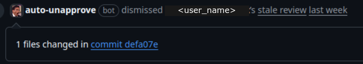
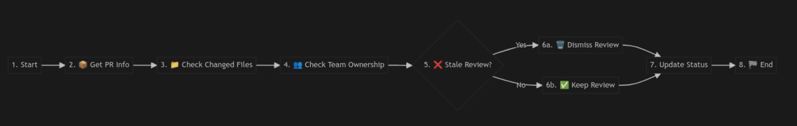

[](https://docs.stepsecurity.io/actions/stepsecurity-maintained-actions)

# 🚫 Auto Unapprove Reviews Action


[](./LICENSE)

GitHub Action for **smart dismissal** of pull request reviews when code owners modify files after approval or when reviewers approve their own changes.

## **Problem & Solution** 


When working with large monorepos, there is a frustrating limitation in GitHub's PR review system.
When new commits are pushed to a PR, GitHub only offers two options:
1. keep all approvals
2. dismiss all approvals.
This binary choice becomes particularly problematic in monorepos where multiple teams own different parts of the codebase.

The **Auto Unapprove Reviews** GitHub Action solves this by providing granular control over review dismissals. It follows a simple but effective flow:

1. Get PR information
2. Check changed files
3. Check team ownership
4. Analyze review status
5. Take appropriate action




## 🚀 **Main Script Features**

**`auto-unapprove.js`** - Smart dismissal with advanced features:
- ✅ **Stale approval detection** - Dismisses approvals when files are modified after approval
- ✅ **Team membership validation** - Supports GitHub team-based code ownership
- ✅ **Precise file matching** - Only dismisses when owned files are actually modified
- ✅ **Performance optimized** - Parallel API calls and efficient caching
- ✅ **Comprehensive logging** - Detailed analysis and reasoning for each decision

## 🚀 **Quick Start**

### **Option 1: GitHub Action** (Recommended)
```yaml
- name: Smart dismiss reviews
  uses: step-security/auto-unapprove@v1
  with:
    github-token: ${{ secrets.GITHUB_TOKEN }}
    pr-number: ${{ github.event.number }}
    dry-run: 'false'
    code-owners-file: 'CODEOWNERS'  # Optional: custom path
    target-branch: ${{ github.event.pull_request.base.ref }}  # Optional: target branch
    team-start-with: '@'  # Optional: team prefix
```

## 🧠 **How It Works**


1. **Get all changed files** from the entire PR (not just latest commit)
2. **Parse CODEOWNERS** from the PR target branch (not default branch) using hierarchical path matching (most specific wins)
3. **Check team memberships** via GitHub API for relevant teams only
4. **Analyze approval timeline** - detect commits made after approval
5. **Smart dismissal logic**:
   - Dismiss code owners who authored commits
   - Dismiss stale approvals (post-approval commits to owned files)
   - Preserve legitimate approvals from non-owners

## 📝 **Example Workflow**

```yaml
name: Auto Unapprove

on:
  pull_request:
    types: [synchronize]

jobs:
  auto-unapprove:
    runs-on: ubuntu-latest

    steps:
      - uses: actions/create-github-app-token@v3
        id: app-token
        with:
          app-id: ${{ vars.REVIEWS_APP_ID }}
          private-key: ${{ secrets.REVIEWS_APP_PRIVATE_KEY }}

      - name: Dismiss Stale Reviews
        uses: step-security/auto-unapprove@v1
        with:
          github-token: ${{ steps.app-token.outputs.token }}
          pr-number: ${{ github.event.number }}
          dry-run: 'false'
          target-branch: ${{ github.event.pull_request.base.ref }}
          team-start-with: '@your-org/'
```

_For more workflow examples, see [`example-workflow.yml`](./example-workflow.yml)_

---

**Required Permissions:**
   for more info on how to use GitHub App token check https://github.com/actions/create-github-app-token

- **Repository permissions:**
  - Administration: Repository creation, deletion, settings, teams, and collaborators. (**READ ONLY**)
  - Contents: Repository contents, commits, branches, downloads, releases, and merges. (**READ ONLY**)
  - Pull requests: Pull requests and related comments, assignees, labels, milestones, and merges. (**READ AND WRITE**)

- **Organization permissions:**
  - Members: Organization members and teams

## ⚙️ **Key Features**

- ✅ **Target branch CODEOWNERS**: Reads ownership rules from PR target branch, not default branch
- ✅ **Stale approval detection**: Automatically detects and dismisses approvals made stale by subsequent commits
- ✅ **Surgical precision**: Only dismisses when owned files are actually modified 
- ✅ **Team support**: Full GitHub team membership validation via API
- ✅ **Timeline analysis**: Compares approval timestamps with commit timestamps
- ✅ **Hierarchical CODEOWNERS**: Proper path matching with most-specific-wins logic
- ✅ **Performance optimized**: Parallel API calls and efficient team checking
- ✅ **Comprehensive logging**: Detailed reasoning for every dismissal decision
- ✅ **Dry-run mode**: Safe testing without actual dismissals

## 📊 **Example Output**

```bash
🚀 Smart Review Dismissal
   Repository: myorg/myrepo
   PR: #123
   Mode: 🧪 DRY RUN

📁 All changed files in PR (3):
   📝 src/gui/components/Button.tsx
   📝 src/gui/styles/theme.css  
   📝 src/gui/utils/helpers.ts

🎯 Target branch: main
👑 Parsed 15 CODEOWNERS rules

🎯 DISMISSAL ANALYSIS:
   🕐 Checking commits after jane-smith's approval (2025-06-04T12:49:59.000Z)...
     📅 Commit 55a4fc5 at 2025-06-04T12:53:44Z
       🎯 Modified owned files: src/gui/components/Button.tsx
   
   🚫 DISMISS @jane-smith
      📁 Files: src/gui/components/Button.tsx, src/gui/styles/theme.css, src/gui/utils/helpers.ts
      👑 Owner Via: @myorg/frontend-team
      💡 Reason: Approval became stale - commits modified owned files
   
   ✅ KEEP @bob-jones
      📄 Not owner of changed files

📊 EXECUTION PLAN:
   • Changed files: 3
   • Total approvals: 2
   • Dismissals needed: 1
   • Approvals preserved: 1
```

## 🔧 **Inputs & Environment Variables**

### **GitHub Action Inputs**
| Input | Required | Default | Description |
|-------|----------|---------|-------------|
| `github-token` | ✅ | - | GitHub API token with repo access |
| `pr-number` | ✅ | - | Pull request number to analyze |
| `dry-run` | - | `true` | Set to 'false' for actual dismissals |
| `code-owners-file` | - | `CODEOWNERS` | Path to CODEOWNERS file |
| `target-branch` | - | `main` | Target branch to read CODEOWNERS from |
| `team-start-with` | - | `@` | Team prefix for organization |

### **Local Execution** (Direct Script Usage)

Action inputs are read via `@actions/core`, which expects `INPUT_<NAME>` environment variables. `GITHUB_REPOSITORY` is a GitHub Actions built-in and is read directly.

```bash
export GITHUB_TOKEN='your_token'
export GITHUB_REPOSITORY='owner/repo'
export PR_NUMBER='123'

env \
  "INPUT_GITHUB-TOKEN=$GITHUB_TOKEN" \
  "INPUT_PR-NUMBER=$PR_NUMBER" \
  "INPUT_DRY-RUN=true" \
  "INPUT_CODE-OWNERS-FILE=CODEOWNERS" \
  "INPUT_TARGET-BRANCH=main" \
  "INPUT_TEAM-START-WITH=@your-org/" \
  GITHUB_REPOSITORY="$GITHUB_REPOSITORY" \
  node auto-unapprove.js
```

| `INPUT_*` Variable | Required | Default | Description |
|--------------------|----------|---------|-------------|
| `INPUT_GITHUB-TOKEN` | ✅ | - | GitHub API token with repo access |
| `INPUT_PR-NUMBER` | ✅ | - | Pull request number to analyze |
| `GITHUB_REPOSITORY` | ✅ | - | Repository in owner/repo format (built-in) |
| `INPUT_TEAM-START-WITH` | - | `@` | Team prefix for organization |
| `INPUT_DRY-RUN` | - | `true` | Set to `false` for actual dismissals |
| `INPUT_CODE-OWNERS-FILE` | - | `CODEOWNERS` | Path to CODEOWNERS file |
| `INPUT_TARGET-BRANCH` | - | `main` | Target branch to read CODEOWNERS from |
| `CHANGED_FILES` | - | - | Newline-separated files (webhook optimization) |

## 🧪 **Testing**

The project includes comprehensive tests for the pagination implementation:

### **Quick Test** (No API calls needed):
```bash
./tests/run-tests.sh
```

### **Test with Real Data**:
```bash
export GITHUB_TOKEN='your_token'
export GITHUB_REPOSITORY='owner/repo'
export PR_NUMBER='123'
./tests/test-real-pagination.sh  # DRY_RUN=true is set automatically
```

### **Test Files**:
- `tests/test-pagination.js` - Logic tests with simulated data
- `tests/test-mock-pagination.js` - Mock API tests
- `tests/test-real-pagination.sh` - Real GitHub API tests
- `tests/TESTING.md` - Comprehensive testing guide

For detailed testing instructions, see [`tests/README.md`](tests/README.md).
